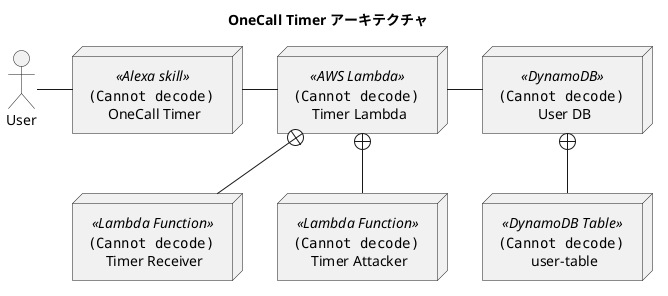

# アーキテクチャ

本リポジトリのアーキテクチャを、UMLで記述します。

ここで記述しているアーキテクチャは、あくまで理想図です。

## OneCall Timer for Alexa

Alexaスキルによる OneCall Timer のアーキテクチャを、UMLの配置図で記述します。

```puml
@startuml
title OneCall Timer アーキテクチャ

!include <aws/common>
!include <aws/Compute/AWSLambda/AWSLambda>

' 既存の AWSLAMBDA マクロの画像ファイルを差替えたオリジナルマクロ
!define AWS(e_text, e_as, e_service, e_image, e_size) AWSLAMBDA(e_as, e_text, node, #000000, e_service, "none><img:e_image{scale=e_size}> <$none")
!define AWS_Light(e_text, e_as, e_service, e_image, e_size) AWS(e_text, e_as, e_service, ./img/AWS-Architecture-Icons_PNG_20200430/PNG Light/e_image, e_size)

' AWSサービス
!define Alexa(e_text, e_as) AWS_Light(e_text, e_as, Alexa skill, Internet of Things/IoT_Alexa-skill_light-bg@4x.png, 0.3)
!define Lambda(e_text, e_as) AWS_Light(e_text, e_as, AWS Lambda, Compute/AWS-Lambda@4x.png, 0.3)
!define LambdaFunction(e_text, e_as) AWS_Light(e_text, e_as, Lambda Function, Compute/AWS-Lambda_Lambda-Function_light-bg@4x.png, 0.3)
!define Dynamo(e_text, e_as) AWS_Light(e_text, e_as, DynamoDB, Database/Amazon-DynamoDB@4x.png, 0.3)
!define Table(e_text, e_as) AWS_Light(e_text, e_as, DynamoDB Table, Database/Amazon-DynamoDB_Table_light-bg@4x.png, 0.3)

actor User as user
Alexa(OneCall Timer, onecall)
Lambda(Timer Lambda, timer)
LambdaFunction(Timer Receiver, receiver)
LambdaFunction(Timer Attacker, attacker)
Dynamo(User DB, user_db)
Table(user-table, user_table)

user - onecall
onecall - timer
timer - user_db

timer +-- receiver
timer +-- attacker

user_db +-- user_table

@enduml
```
